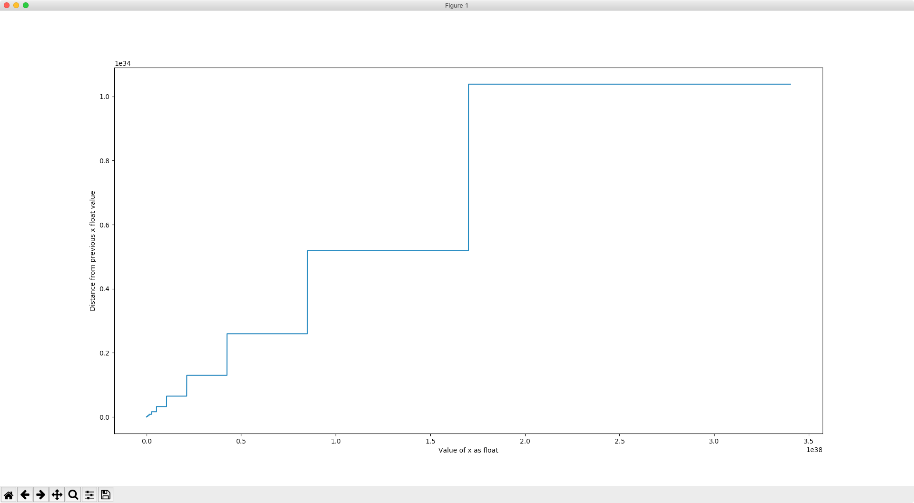

# Float Precision

This project is meant to show how the finite set of representable floating-point numbers
requires "jumps" in precision in order to span an infinite domain of values (or larger domain of values if excluding -/+ infinity).

## Example Graph

## Building & graphing data
To build an out_floats.json file:
- Modify constants at top of build_float_set.py as desired
- Run build_float_set.py to build the out_floats.json file
- Run graph.py to graph load and chart the data in out_floats.json
